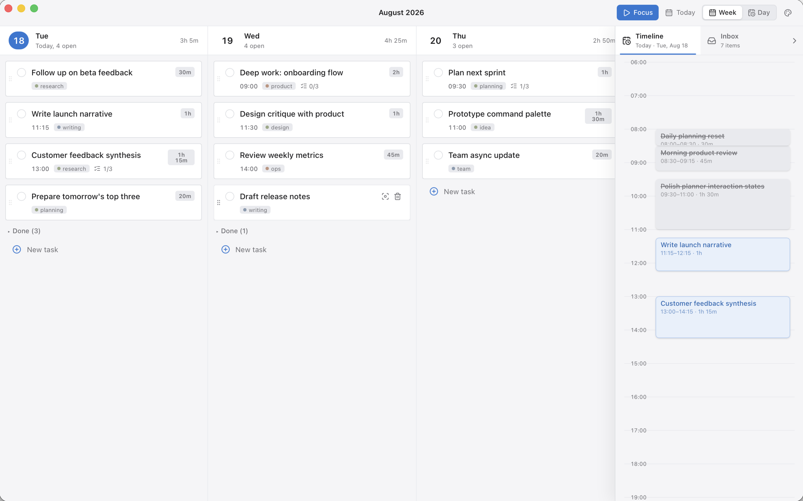
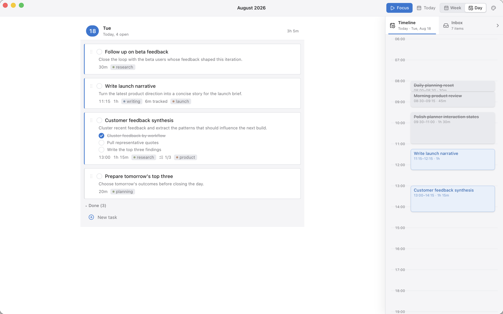
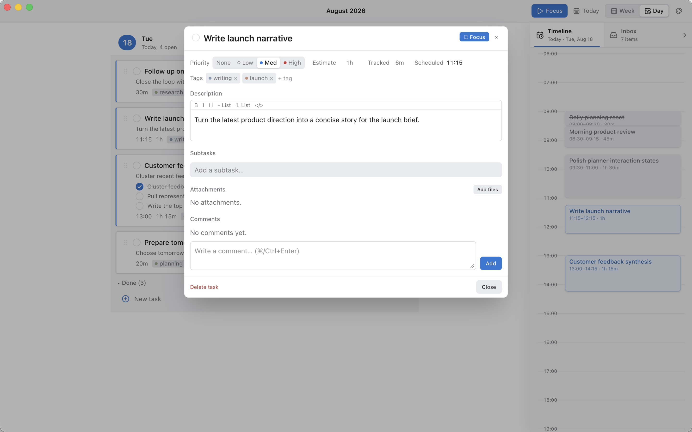
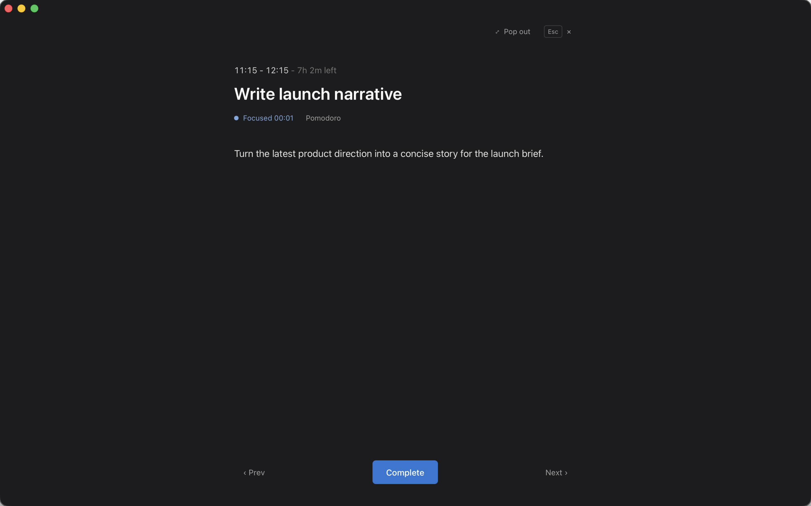

# Kairos

Kairos is a private time blocking planner for macOS. It turns a crowded week into a realistic plan, then helps you protect the time and focus on one task at a time.

No account is required. Tasks, notes, attachments, and planning history stay in an app-scoped SQLite database on your Mac.

<p align="center">
	
</p>

## See Kairos in Action

<table>
	<tr>
		<td width="50%" valign="top">
			<strong>Give important work an hour</strong><br />
			Open a day, schedule tasks beside it, and adjust the plan when reality changes.
			<br /><br />
			
		</td>
		<td width="50%" valign="top">
			<strong>Open the task, not another app</strong><br />
			Notes, next steps, comments, files, estimates, and tracked time stay with the work.
			<br /><br />
			
		</td>
	</tr>
</table>

### Stop Planning. Start the Block.

Focus mode clears the board and keeps one task, its next steps, and the session timer in view. A compact floating widget can keep the active session visible while the main window stays available.

<p align="center">
	
</p>

## What It Does

- Capture unscheduled work in Inbox
- Plan across fixed-width day columns without losing context
- Drag tasks between days or onto the selected day's Timeline
- Expand one day for notes and inline subtasks
- Keep Timeline and Inbox in one persistent inspector
- Track estimates and actual time
- Add comments, tags, priority, and local file attachments
- Run focused sessions with an optional Pomodoro rhythm
- Keep the active session visible in a floating widget

## Product Model

Kairos follows one planning loop:

1. **Capture** work before it is forgotten.
2. **Shape the week** around what can realistically fit.
3. **Commit time** on the Timeline.
4. **Focus** on the task in front of you.

The same task can appear in the week, selected day, Timeline, task details, and Focus mode. Zustand owns these loaded projections and reconciles mutations from the canonical SQLite row so each view stays current.

## Architecture

- `src/components/PlannerShell.tsx`: week/day workspace, drag and drop, Timeline/Inbox inspector
- `src/store.ts`: planner state, optimistic mutations, projection reconciliation, Focus and Pomodoro state
- `src/db.ts`: SQLite repository and task queries with derived subtask/attachment counts
- `src/lib/taskProjection.ts`: pure reconciliation across day, week, Inbox, carry-over, and open detail state
- `src/components/TaskItem.tsx`: shared task presentation for week cards, expanded day cards, and Inbox rows
- `src-tauri/src/lib.rs`: Tauri plugins, SQLite migrations, and attachment file commands

## Tech Stack

- Frontend: React 19, Vite 7, TypeScript 5, Zustand
- Desktop shell: Tauri 2
- Storage: SQLite via tauri-plugin-sql

## Requirements

- Node.js 22+
- pnpm 10+
- Rust toolchain (stable)
- Platform build prerequisites for Tauri

## Local Development

Install dependencies:

```bash
pnpm install
```

Run web UI only:

```bash
pnpm dev
```

Run desktop app in dev mode:

```bash
pnpm tauri dev
```

## Quality Checks

Run unit tests:

```bash
pnpm test
```

Run production web build:

```bash
pnpm build
```

Run full release checks used before shipping:

```bash
pnpm release:check
```

This runs unit tests, the TypeScript/Vite production build, and `cargo check` for the Tauri shell.

## Build Desktop Bundles

```bash
pnpm tauri build
```

On macOS this outputs `.app` and `.dmg` bundles under `src-tauri/target/release/bundle`.

## Download

Kairos currently ships as an Apple Silicon preview for macOS. Download the DMG and its SHA-256 checksum from [GitHub Releases](https://github.com/abdellahi-brahim/kairos/releases).

The preview is not notarized, so macOS may block its first launch. After copying Kairos to Applications, right-click the app and choose **Open**. A signed and notarized stable release will follow.

Release instructions for maintainers live in [`.github/RELEASING.md`](.github/RELEASING.md).

## Data and Privacy

Kairos stores planner data locally on the device in an app-scoped SQLite database.
Attachment files are copied into the app data directory under `attachments/`.

On macOS, planner data lives under:

```text
~/Library/Application Support/com.abdoul.dailyplanner/
```

The bundle identifier remains `com.abdoul.dailyplanner` so existing users keep their local database when the display name changes.

## Roadmap

Current product direction, including Google Calendar, Jira, private device sync, and additional desktop platforms, is published at [kairos.abdellahibrahim.com/roadmap](https://kairos.abdellahibrahim.com/roadmap/).

## Project Status

Kairos is in public beta. The core workflow is usable today, while packaging, updates, integrations, and cross-platform support continue to evolve.
